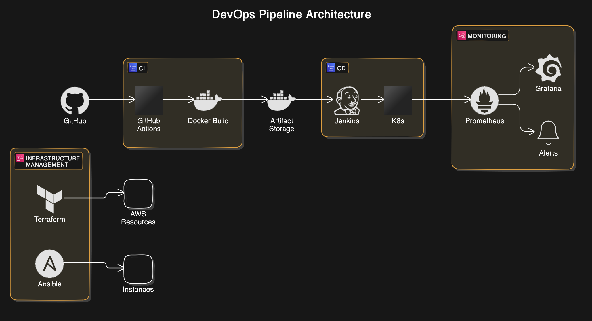
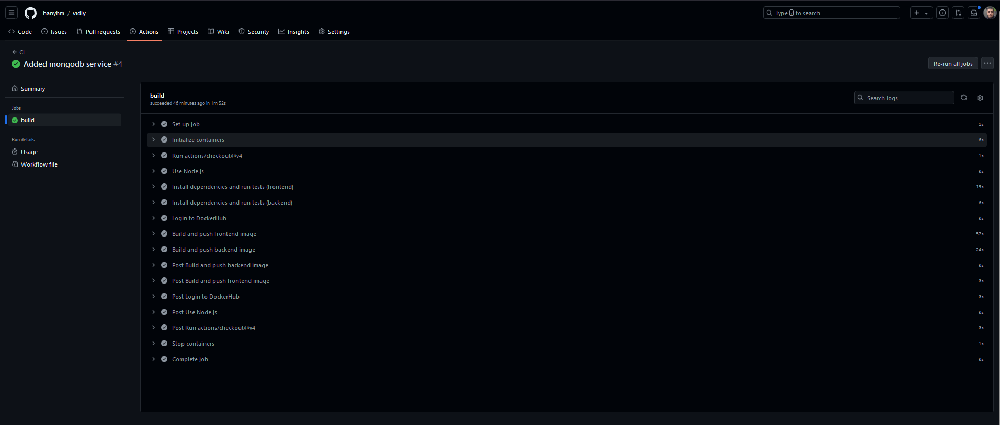

# Vidly DevOps Project

## Introduction

This project demonstrates a comprehensive DevOps pipeline for the Vidly application, a video rental platform. It showcases the implementation of modern DevOps practices and tools, focusing on automation, continuous integration, continuous deployment, and monitoring.

The pipeline is designed to streamline the development process, ensure code quality, enable rapid and reliable deployments, and provide robust monitoring capabilities.

## Project Scope

This project encompasses:

1. Source Code Management using GitHub
2. Containerization of the application using Docker
3. Continuous Integration (CI) using GitHub Actions
4. Container Registry management with Docker Hub
5. Continuous Deployment (CD) using Jenkins
6. Orchestration with Kubernetes
7. Monitoring and observability with Prometheus and Grafana

## Architecture



The Vidly application consists of three main components:

1. Frontend: A React-based web application
2. Backend: A Node.js API server
3. Database: MongoDB for data storage

These components are containerized and deployed to a Kubernetes cluster. The entire system is monitored using Prometheus and Grafana.


## Technologies Used

- Version Control: GitHub
- Programming Languages: JavaScript (Node.js, React)
- Containerization: Docker
- CI/CD: GitHub Actions, Jenkins
- Orchestration: Kubernetes
- Monitoring: Prometheus, Grafana
- Database: MongoDB


## Project Structure

```bash
vidly/
├── frontend/
│   ├── Dockerfile
│   └── ... (React app files)
├── backend/
│   ├── Dockerfile
│   └── ... (Node.js app files)
├── k8s/
│   ├── frontend-deployment.yaml
│   ├── backend-deployment.yaml
│   ├── mongodb-deployment.yaml
│   ├── prometheus-config.yaml
│   └── grafana-deployment.yaml
├── .github/
│   └── workflows/
│       └── ci.yml
├── Jenkinsfile
└── README.md
```

## CI/CD Pipeline

1. **Code Commit**: Developers push code to the GitHub repository.
2. **Continuous Integration**: 
   - GitHub Actions triggers automated tests for both frontend and backend.
   - If tests pass, Docker images are built and pushed to Docker Hub.
3. **Continuous Deployment**:
   - Jenkins pulls the latest images and deploys to the Kubernetes cluster.
4. **Monitoring**:
   - Prometheus continuously collects metrics from the deployed applications.
   - Grafana provides visualization of these metrics.

## Setup Instructions

### 1. Clone the repository:
```bash
git clone https://github.com/hanyhm/vidly.git
```

### 2. Set up Docker Hub credentials in GitHub Secrets:
```bash
- DOCKERHUB_USERNAME
- DOCKERHUB_PASSWORD
```

### 3. Install Required Software:
a. Install Jenkins:
```bash
wget -q -O - https://pkg.jenkins.io/debian-stable/jenkins.io.key | sudo apt-key add -
sudo sh -c 'echo deb http://pkg.jenkins.io/debian-stable binary/ > /etc/apt/sources.list.d/jenkins.list'
sudo apt update
sudo apt install jenkins
```
b. Install Docker:
```bash
sudo apt install docker.io
sudo usermod -aG docker jenkins
sudo usermod -aG docker $USER
```

c. Install Minikube:
```bash
curl -LO https://storage.googleapis.com/minikube/releases/latest/minikube-linux-amd64
sudo install minikube-linux-amd64 /usr/local/bin/minikube
```

d. Install kubectl:
```bash
curl -LO "https://dl.k8s.io/release/$(curl -L -s https://dl.k8s.io/release/stable.txt)/bin/linux/amd64/kubectl"
sudo install -o root -g root -m 0755 kubectl /usr/local/bin/kubectl
```

### 4. Configure Jenkins:
a. Open Jenkins in your browser (typically http://localhost:8080)
b. Install suggested plugins
c. Create an admin user
d. Install additional plugins: Docker Pipeline, Kubernetes CLI
e. Configure Jenkins to use Docker as the build agent

#### Set up Jenkins Credentials:
a. Go to "Manage Jenkins" > "Manage Credentials"
b. Add Docker Hub credentials (Username with password)
c. Add GitHub credentials if your repository is private

#### Create Jenkins Pipeline:
a. Click "New Item"
b. Choose "Pipeline" and give it a name
c. In the Pipeline section, choose "Pipeline script from SCM"
d. Set SCM to Git and provide your repository URL
e. Set the branch to */main
f. Set the Script Path to "jenkins/Jenkinsfile"

#### Configure Minikube for Jenkins:
a. SSH into your Jenkins server
b. Switch to the jenkins user: 
```bash 
sudo su - jenkins
```
c. Start Minikube: 
```bash 
minikube start --driver=docker
```
d. Stop Minikube:
```bash
 minikube stop
 ```

#### Adjust Permissions:
```bash
sudo chmod 666 /var/run/docker.sock
sudo usermod -aG docker jenkins
```

#### Restart Jenkins:
```bash
sudo systemctl restart jenkins
```

### 5. Create a Jenkins job that uses the Jenkinsfile in the repo.

### 6. Set up a GitHub webhook to trigger the Jenkins job on push to the main branch.

### 7. Deploy Prometheus and Grafana:
```bash
kubectl apply -f k8s/prometheus-config.yaml
kubectl apply -f k8s/grafana-deployment.yaml
```

8. Access Grafana and set up dashboards to visualize your application metrics.

## Usage

- Push changes to the main branch to trigger the CI/CD pipeline.
- Monitor the GitHub Actions workflow and Jenkins job for deployment status.
- Access the application.
- View application metrics and performance in Grafana.

## Monitoring

- Prometheus is set up to scrape metrics from all Kubernetes pods.
- Grafana provides visualization of these metrics.
- Default dashboards include:
- Kubernetes cluster overview
- Node.js application metrics
- MongoDB performance metrics

## Commands to test App

### 1. Clone the repository:
```bash
git clone https://github.com/hanyhm/vidly.git
```
### 2. CD into repo and run test
```bash
cd vidly
cd frontend
npm test
cd ..
cd backend
npm test
```
### 3. Use Docker compose to run app in Docker
ps. You must have Docker & Docker compose installed on your machine

```bash
cd vidly
docker compose up -d
```
check app at http://localhost:3000

### 4. Ttrigger CI

Make a change to the source code and watch GitHub Actions workflow to test and update docker images of the application.




This DevOps Pipeline Showcase Project demonstrates the ability to design, implement, and manage
a modern, cloud-native application lifecycle.

## Contributing

Please read [CONTRIBUTING.md](CONTRIBUTING.md) for details on our code of conduct, and the process for submitting pull requests.

## License

This project is licensed under the MIT License - see the [LICENSE.md](LICENSE) file for details.

